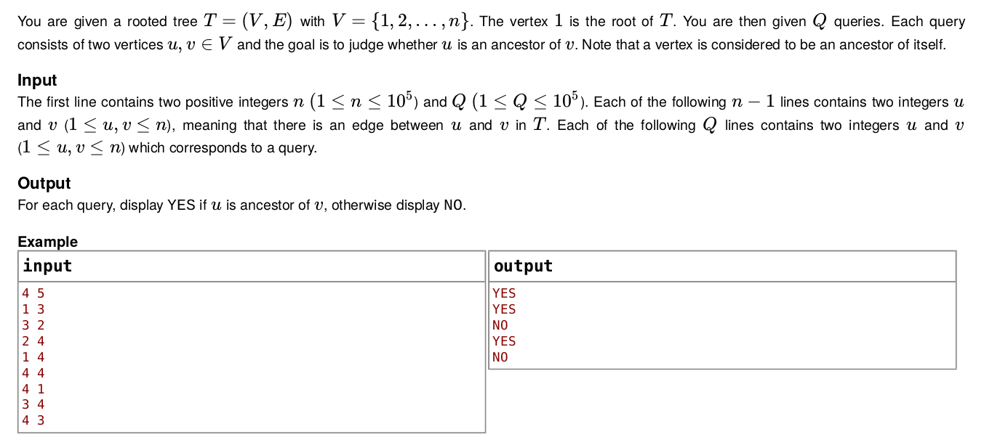

# PHP - Rooted Tree Queries

Script that reads an input file (default `input.txt`) following the next instructions:

## Algorithm
The script executes the following logic:
* Initializes an array that represents the rooted tree.
* Reads first line of the input, defining:
    * `n`: Number of vertices and size of array.
    * `Q`: Number of queries to read.
* Reads next `n-1` lines, dividing the line in two integers:
    * `int2` which corresponds to the second integer and represents a node.
    * `int1` which represents the parent node of `int2`.
    * The value at the index `int2 - 1` of the array is set to `int - 1`.
* Reads the next `Q` lines, doing the next evaluation:
    * Returns `true` if `int1 == int2`, `int1 == 1` or if `int1` is found to be a predecesor of `int2`.
        * To evaluate the last condition the value at `tree[int2 - 1]` is checked. If it equals `int1 - 1` the condition is `true`. If not then the value found in the `tree[tree[int2 - 1]]` is checked, and so on, until `int1 - 1` is found or the value equals the root node, in which case the result is `false`.

## Running script
The script comes with a Dockerfile to containerize the application. To run the corresponding container once, the next command is enough:

    docker run --rm -it $(docker build -q .)

This will quietly build the container, run the application, and remove it once the execution finishes.